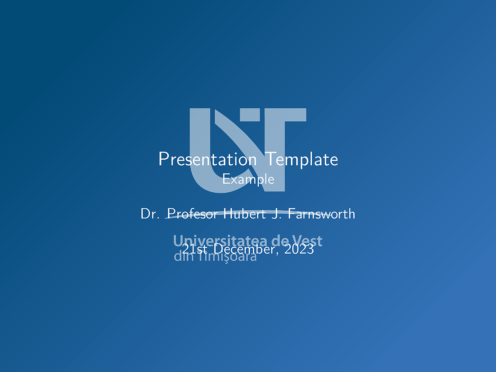
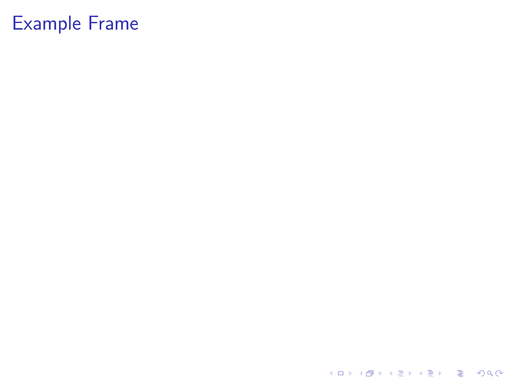

# UVT Beamer Theme

This is a reproduction of the UVT (West University of Timișoara) Power Point in
Latex. It uses the UVT [branding](https://dci.uvt.ro/identitate-vizuala)
and is based on the example given in the
[Official Manual](https://www.dci.uvt.ro/wp-content/uploads/2019/03/MANUAL-IDENTITATE-NEW-WEB-FINAL-2016-.pdf).

This theme is very much a **work in progress** at the moment. As the example in
the official branding manual is not very friendly to scientific presentations,
this theme will probably take some liberties with it.

## Fonts

Note that, by default this uses the [Myriad Pro](https://fonts.adobe.com/fonts/myriad)
font. This font is generally not available for free, but can be purchased from
Adobe or a [reseller](https://www.fontspring.com/fonts/adobe/myriad-pro). The
OTF fonts can be directly loaded by the `XeLaTeX` or `LuaLaTeX` engines. To
get it working on `PDFLaTeX`, use the [FontPro](https://github.com/sebschub/FontPro)
distribution. If you cannot obtain the font (or the installation does not work
for some reason), it can be disabled with the `nomyriadpro` option. In general,
we recommend using a free sans serif font instead, e.g `\usepackage{helvet}` for
the Helvetica look-alike Nimbus Sans L or `\usepackage{paratype}` for the PT Sans
fonts that resemble Myriad Pro better.

## What it looks like

[Full PDF](template.pdf)

## License

Creative Commons Attribution 4.0 International
