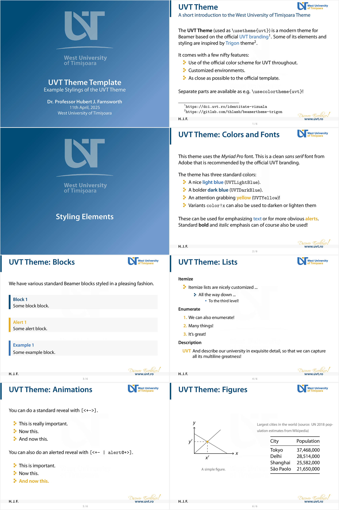

# UVT Beamer Theme

> [!NOTE]
> This template style is fairly complete and working well, but any feature requests
> or bug reports to improve it are **very welcome**!

This is a reproduction of the UVT (West University of Timișoara) Power Point
template in LaTeX. It uses the official [UVT branding](https://dci.uvt.ro/identitate-vizuala)
and is based on the example given in the
[Official Manual](https://www.dci.uvt.ro/wp-content/uploads/2019/03/MANUAL-IDENTITATE-NEW-WEB-FINAL-2016-.pdf).
As the example in the official branding manual is not very friendly to scientific
presentations, this theme will probably take some liberties with it.

Templates in the same series:
* [UVT Letterhead Template](https://github.com/alexfikl/uvt-letterhead)
* [UVT Beamer Presentation Template](https://github.com/alexfikl/uvt-beamer)
* [UVT Conference Poster Template](https://github.com/alexfikl/uvt-poster)

## How to use it

Copy the `beamerthemeuvt.sty` and the accompanying `beamercolorthemeuvt.sty` file
to your local directory together with any relevant assets from the `assets` folder. You can
use the `template.tex` file to get you started with a few useful options and examples.
The `template.tex` can then be built with `PDFLaTeX` (or `XeLaTeX` or `LuaLaTeX`
for the adventurous).

The package defines the following options used as `\usetheme[opts]{uvt}`.

| Option                            | Description                           |
| :-                                | :-                                    |
| `nomyriadpro`                     | Do not load the *Myriad Pro* fonts    |
| `language=<lang>`                 | One of *english* or *romanian*        |
| `progressbar`                     | Adds a yellow progress bar in the footer |
| `showframe`                       | Shows a frame around page elements (margins, etc.) |
| `layoutgrid`                      | Adds a debug grid to check alignment  |

## Fonts

Note that, by default this uses the [Myriad Pro](https://fonts.adobe.com/fonts/myriad)
font. This font is generally not available for free, but can be purchased from
Adobe or a [reseller](https://www.fontspring.com/fonts/adobe/myriad-pro). The
OTF fonts can be directly loaded by the `XeLaTeX` or `LuaLaTeX` engines. To
get it working on `PDFLaTeX`, use the [FontPro](https://github.com/sebschub/FontPro)
distribution. If you cannot obtain the font (or the installation does not work
for some reason), it can be disabled with the `nomyriadpro` option. When the font
is not found, the class falls back to using `\usepackage{helvet}`, which loads a
Helvetica look-alike called Nimbus Sans L.

If you are using `XeLaTeX` or `LuaLaTeX`, there are many other nice fonts to
keep in mind that would work well. For example: Carlito (a Calibri clone),
Caladea (a Cambria clone), Montserrat (inspired by Gotham), Adobe Source Sans,
etc. A nice font will always make your presentation look nicer!

## What it looks like

[Full PDF](template.pdf)

## License

Creative Commons Attribution 4.0 International
